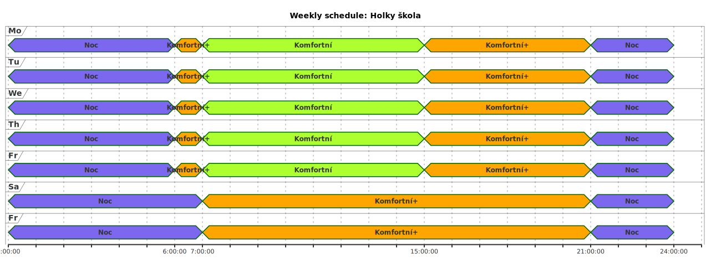

# netatmo4j 

Library for calling the Netatmo API and providing data in Java classes.

Data models are in the package `net.suteren.netatmo.domain`.

Classes for calling Netatmo server are in `net.suteren.netatmo.therm`.
Currently only thermostat and valves are supported.

For authentication there is `net.suteren.netatmo.auth.AuthClient`.
It is required by API classes.
If you try to connect to the API, it opens Netatmo web page in the web browser,
let you log in and approve the application, and then it stores auth token and refresh token into the `~/.netatmoauth.json` file,
so you don't have to log in every request.

See [Netatmo Authentication](https://dev.netatmo.com/apidocumentation/oauth) for details.

There is also a simple commandline client and timeline visualizer. See the sections below.

## Basic usage

[neatmo4j artifact](https://central.sonatype.com/artifact/net.suteren.netatmo/netatmo4j) is hosted on [Maven Central](https://central.sonatype.com/)

```java

AuthClient authClient =	new AuthClient(clientId, clientSecret, List.of("read_thermostat", "write_thermostat"), "Netatmo tool", authconfig);

HomeClient homeClient = new HomeClient(authClient).getHomesData();
HomesData homesData = homeClient.getHomesData();

ScheduleClient scheduleClient = new ScheduleClient(authClient);
Schedule schedule = createSchedule();
scheduleClient.updateSchedule(homeId, schedule);
scheduleClient.setSchedule(homeId, scheduleId);

```

## Commandline client

This is a commandline tool for querying netatmo server and updating the schedule by configuration.
See `net.suteren.netatmo.cli.NetatmoCli`.

You can build fat-jar artifact which creates executable jar of this client:

```shell
gradle fatJar
```

Then you can execute this command:

```shell
./build/libs/netatmo4j-${VERSION}-fatjar.jar -h
```

## Timeline visualiser

If you want to visualize timeline of the schedule,
you can use groovy script [`scheduleRendered.groovy`](bin/scheduleRendered.groovy).
Pass Schedule JSON as a parameter.
Then it will render either SVG or PlantUml source, depending on presence of the `-i` flag.

Example of the result: 